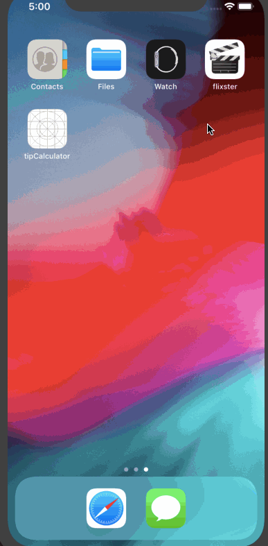

# Lab 3 - Flixster

**Flixster** is a movies app displaying box office and top rental DVDs using [The Movie Database API](http://docs.themoviedb.apiary.io/#).

Time spent: **2** hours spent in total

## User Stories

The following **required** user stories are complete:

- The following screens use AutoLayout to adapt to various orientations and screen sizes
   - [x] Movie feed view (+3pt)
   - [x] Detail view (+2pt)

The following **stretch** user stories are implemented:

- [ ] Dynamic Height Cells (+1)
- [ ] Collection View AutoLayout (+2)

The following **additional** user stories are implemented:

- [ ] List anything else that you can get done to improve the app functionality! (+1-3pts)

Please list two areas of the assignment you'd like to **discuss further with your peers** during the next class (examples include better ways to implement something, how to extend your app in certain ways, etc):

1. How figure out constaints for large scale projects
2. Working on manually inputting the constraints is better than auto doing it.

## Video Walkthrough

Here's a walkthrough of implemented user stories:

GIF created with [LiceCap](http://www.cockos.com/licecap/).

## Notes

Constraints were quite difficult to get properly aligned

### User Stories

#### REQUIRED (10pts)
- [x] (5pts) User can tap a cell to see more details about a particular movie.
- [x] (5pts) User can tap a tab bar button to view a grid layout of Movie Posters using a CollectionView.

#### BONUS
- [ ] (2pts) User can tap a poster in the collection view to see a detail screen of that movie.
- [ ] (2pts) In the detail view, when the user taps the poster, a new screen is presented modally where they can view the trailer.

### App Walkthough GIF

 

### Notes
I messed up once by adding a breakpoint randomly in the app, and I didn't know how to get rid of it.

---

## Flix Part 1

### User Stories

#### REQUIRED (10pts)
- [x] (2pts) User sees an app icon on the home screen and a styled launch screen.
- [x] (5pts) User can view and scroll through a list of movies now playing in theaters.
- [x] (3pts) User can view the movie poster image for each movie.

#### BONUS
- [ ] (2pt) User can view the app on various device sizes and orientations.
- [x] (1pt) Run your app on a real device.

### App Walkthough GIF

 

### Notes
Describe any challenges encountered while building the app.
